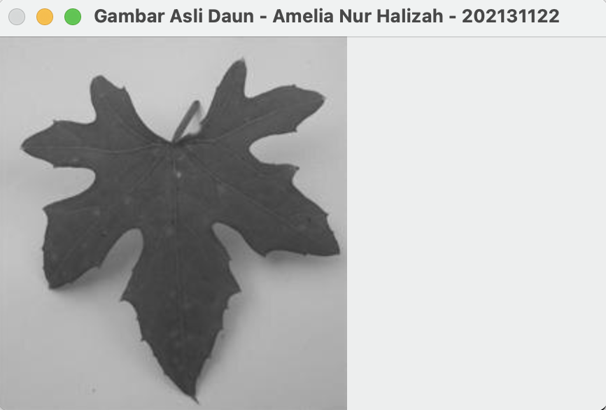

# Amelia Nur Halizah
## _202131122 - Pengolahan-Citra_ITPLN_

Program ini adalah syarat wajib pengumpulan tugas mata kuliah Pengolahan Citra.
Berikut hasil running perbedaan gambar awal dan gambar yang menggunakan citra aras.

| Gambar Awal | Gambar Aras |
| ------ | ------ |
|  |  |

##### Semoga bermanfaat!!😃
